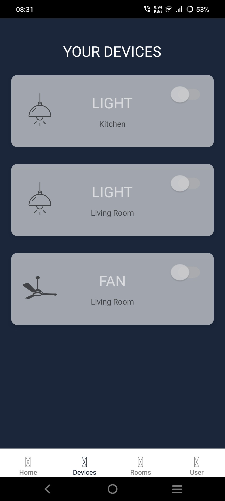

# Smart Home Automation

## Overview
This project is a **gesture-controlled smart home automation system** that combines hardware, sensors, and a mobile app to provide seamless control of household appliances.  

The system is designed as a **prototype for future smartwatch-based automation**, where simple hand movements can manage devices without the need for physical switches or continuous phone interaction.  

By integrating **Bluetooth communication**, **accelerometer-based gesture recognition**, and **environmental sensing**, the project demonstrates how **smart wearables** can revolutionize the way we interact with our homes.

---

## Why This Project?
Traditional home automation systems often rely on **mobile apps or voice assistants**, which may not always be convenient. With the rise of wearable devices such as **smartwatches**, gesture-based interaction becomes a natural and intuitive alternative.  

This project explores that idea by using an **accelerometer (tilt gestures)** as a prototype for smartwatch integration. A simple **double-tap gesture enables or disables gesture mode**, after which tilts can:

- **Switch between appliances** (left/right tilt).  
- **Toggle their states** (up/down tilt).  

This approach allows **hands-free, effortless control**, making automation more accessible, futuristic, and user-friendly.

---

## Features

### 🔹 Dual Control Modes
- **Mobile App (Bluetooth)**: Control appliances, monitor temperature & humidity, and switch modes.  
- **Gesture Mode (Accelerometer)**: Tilts control devices, double-tap toggles gesture mode.  

### 🔹 Environmental Sensing
- **DHT11 Sensor** measures temperature and humidity.  
- Values displayed in the app.  

### 🔹 Real-Time Feedback
- Appliance status shown on the app and LCD.  
- Logs actions for debugging and monitoring.  

### 🔹 Prototype for Smartwatch Integration
- Tilt-based control simulates future wearable automation systems.  
- Reduces dependency on smartphones.  

---

## Mobile App
The **React Native app** acts as the user’s **central hub** for control and monitoring:

- Bluetooth connection with Arduino (**via HC-05**).  
- UI to control appliances (on/off states).  
- Live sensor readings (**temperature, humidity**).  
- Gesture mode toggle to activate/deactivate accelerometer-based control.  
- User profile for personalization.  

This ensures that even without gestures, the user always has a **reliable fallback control system**.

---

## Future Scope
- Direct integration with **smartwatches** (bypassing Arduino-based accelerometer).  
- Support for **voice + AI-based automation**.  
- **Cloud connectivity** for remote control outside Bluetooth range.  

---

## 📱 UI Images

### 1. **Home Screen**

### 2. **Living Room**

### 3. **User Profile**

### 4. **Your Devices**

### 5. **Your Rooms**

